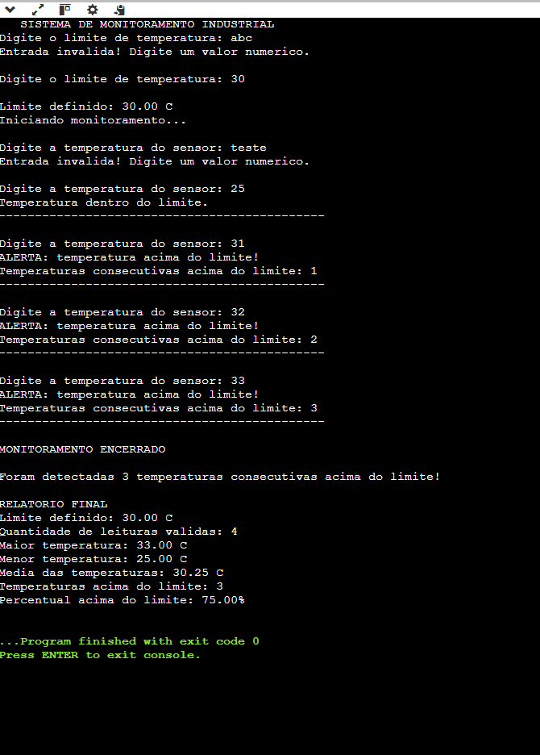
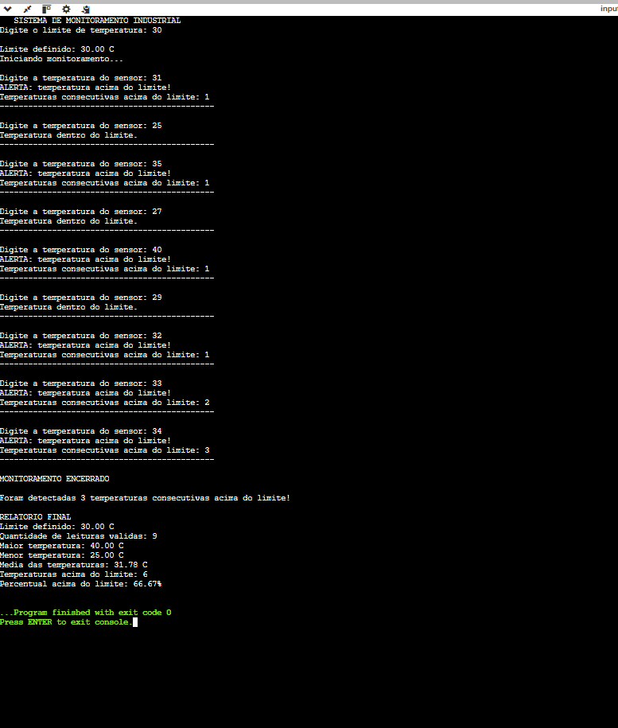
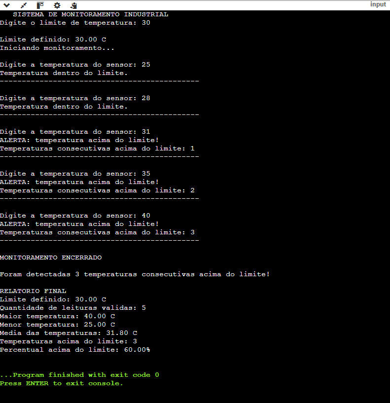

# Sistema Inteligente de Monitoramento Industrial

## 1. Identificação

**Aluno:** Bernardo Kopp Pinheiro  
**Disciplina:** Algoritmos e Pensamento Computacional  
**Professora:** Profa. Karla Sartin  
**Título do projeto:** Sistema Inteligente de Monitoramento Industrial  

---

## 2. Objetivo

O objetivo deste projeto é desenvolver, em linguagem C, um sistema capaz de monitorar a temperatura de uma máquina industrial.

O programa permite definir um limite de temperatura e registrar diversas leituras de um sensor. Durante o monitoramento, o sistema identifica temperaturas acima do limite estabelecido e encerra automaticamente o processo caso sejam detectadas três temperaturas consecutivas acima desse limite.

Ao final do monitoramento, o programa apresenta um relatório contendo informações sobre as temperaturas registradas.

---

## 3. Funcionamento do programa

### Definição do limite de temperatura

No início da execução, o usuário informa o limite de temperatura que será utilizado pelo sistema.

O programa verifica se o valor informado é numérico. Caso seja digitada uma entrada inválida, uma mensagem de erro é exibida e o valor é solicitado novamente.

### Leituras das temperaturas

Após a definição do limite, o programa começa a receber as temperaturas registradas pelo sensor.

Cada temperatura válida é utilizada para atualizar:

- quantidade total de leituras;
- soma das temperaturas;
- maior temperatura registrada;
- menor temperatura registrada;
- quantidade de temperaturas acima do limite;
- quantidade de temperaturas consecutivas acima do limite.

### Tratamento de valores inválidos

Caso o usuário informe um valor não numérico, a entrada é considerada inválida.

O programa exibe uma mensagem de erro, descarta a entrada incorreta e solicita um novo valor.

As entradas inválidas não são consideradas nos cálculos do relatório final.

### Identificação de temperaturas acima do limite

Sempre que uma temperatura registrada for maior que o limite definido, o programa exibe um alerta e incrementa a quantidade de temperaturas acima do limite.

Também é incrementado o contador responsável por identificar temperaturas consecutivas acima do limite.

### Controle de temperaturas consecutivas

O programa possui um contador específico para controlar quantas temperaturas consecutivas ultrapassaram o limite estabelecido.

Quando uma temperatura ultrapassa o limite, esse contador é incrementado.

Caso uma temperatura seja menor ou igual ao limite, o contador de temperaturas consecutivas é reiniciado para zero.

Por exemplo, considerando um limite de 30 °C:

```text
31 °C -> acima do limite -> contador = 1
35 °C -> acima do limite -> contador = 2
29 °C -> dentro do limite -> contador = 0
32 °C -> acima do limite -> contador = 1
34 °C -> acima do limite -> contador = 2
36 °C -> acima do limite -> contador = 3
```

### Encerramento do monitoramento

O monitoramento é encerrado automaticamente quando são identificadas três temperaturas consecutivas acima do limite.

Após o encerramento, o programa apresenta um relatório final contendo os resultados obtidos durante o monitoramento.

---

## 4. Estruturas de repetição utilizadas

Neste projeto foram utilizadas as estruturas de repetição `while` e `do...while`.

### do...while

O `do...while` foi utilizado durante a definição e validação do limite de temperatura.

Essa estrutura foi escolhida porque o programa precisa solicitar o limite pelo menos uma vez antes de verificar se a entrada é válida.

Caso a entrada seja inválida, o laço executa novamente e solicita um novo valor.

### while

O `while` foi utilizado durante o monitoramento das temperaturas.

O programa continua solicitando novas temperaturas enquanto a quantidade de temperaturas consecutivas acima do limite for menor que três.

Também foi utilizado um `while` para limpar entradas inválidas, descartando os caracteres incorretos antes de solicitar uma nova entrada.

---

## 5. Como executar

Para compilar o programa utilizando o GCC:

```bash
gcc monitoramento.c -o monitoramento
```

Para executar no Windows:

```bash
monitoramento.exe
```

Para executar no Linux ou macOS:

```bash
./monitoramento
```

Após iniciar o programa, basta seguir as instruções apresentadas no terminal.

---

## 6. Testes realizados

Foram realizados três cenários de teste para verificar o funcionamento do sistema.

### Teste 1 — Validação de entradas inválidas

Neste teste, foram inseridos valores não numéricos durante a definição do limite e durante o registro das temperaturas.

O programa identificou corretamente as entradas inválidas, exibiu uma mensagem de erro e solicitou um novo valor.

As entradas inválidas foram descartadas e não foram consideradas nos cálculos do relatório final.

**Evidência do teste:**



---

### Teste 2 — Temperaturas acima do limite, porém não consecutivas

Neste teste, foi utilizado o limite de 30 °C.

Foram inseridas temperaturas acima do limite intercaladas com temperaturas menores ou iguais ao limite.

Exemplo:

```text
31 °C
25 °C
35 °C
27 °C
40 °C
29 °C
32 °C
33 °C
34 °C
```

O programa identificou corretamente as temperaturas acima do limite.

Sempre que uma temperatura dentro do limite foi registrada, o contador de temperaturas consecutivas retornou para zero.

Dessa forma, o monitoramento não foi encerrado apenas pela quantidade total de temperaturas acima do limite. O encerramento ocorreu somente quando foram registradas três temperaturas consecutivas acima do limite.

**Evidência do teste:**



---

### Teste 3 — Três temperaturas consecutivas acima do limite

Neste teste, foi utilizado novamente o limite de 30 °C.

Foram registradas as seguintes temperaturas:

```text
25 °C
28 °C
31 °C
35 °C
40 °C
```

As três últimas temperaturas ultrapassaram consecutivamente o limite:

```text
31 °C -> contador = 1
35 °C -> contador = 2
40 °C -> contador = 3
```

Ao detectar a terceira temperatura consecutiva acima do limite, o programa encerrou automaticamente o monitoramento e apresentou o relatório final.

**Evidência do teste:**



---

## 7. Relatório final

Após o encerramento do monitoramento, o programa apresenta:

- quantidade total de leituras válidas;
- maior temperatura registrada;
- menor temperatura registrada;
- média das temperaturas;
- quantidade de temperaturas acima do limite;
- percentual de temperaturas acima do limite.

A média é calculada utilizando:

```text
soma das temperaturas / quantidade de leituras
```

O percentual de temperaturas acima do limite é calculado utilizando:

```text
(quantidade de temperaturas acima do limite / quantidade total de leituras) * 100
```

---

## 8. Estrutura do projeto

O repositório está organizado da seguinte forma:

```text
desafio-monitoramento/
│
├── monitoramento.c
├── README.md
│
└── evidencias/
    ├── teste01.png
    ├── teste02.png
    └── teste03.png
```

O arquivo `monitoramento.c` contém o código-fonte do programa.

O arquivo `README.md` contém a documentação do projeto.

A pasta `evidencias` contém as imagens dos três testes realizados.

---

## 9. Questão final de reflexão

**Por que você escolheu `while`, `do...while` ou uma combinação das duas estruturas? Em qual parte do algoritmo a diferença entre testar a condição antes ou depois da execução foi importante para sua solução?**

Escolhi utilizar uma combinação das estruturas `while` e `do...while`, pois cada uma delas atende melhor a uma situação diferente dentro do programa.

O `do...while` foi utilizado na etapa de definição e validação do limite de temperatura. Essa estrutura foi escolhida porque o programa precisa solicitar um valor ao usuário pelo menos uma vez antes de verificar se a entrada é válida. Como o `do...while` executa o bloco primeiro e verifica a condição depois, ele se encaixa bem nessa situação.

Já o `while` foi utilizado durante o monitoramento das temperaturas. Nesse caso, antes de continuar recebendo novas leituras, o programa verifica se ainda não foram registradas três temperaturas consecutivas acima do limite. Enquanto essa condição não for atingida, o monitoramento continua.

Também foi utilizado um `while` para auxiliar na limpeza das entradas inválidas, permitindo que o programa descarte os caracteres incorretos antes de solicitar uma nova entrada.

Portanto, a diferença entre testar a condição antes ou depois da execução foi importante principalmente na validação inicial. O `do...while` garante que a solicitação seja executada pelo menos uma vez, enquanto o `while` permite verificar a condição antes de iniciar uma nova repetição do monitoramento.
